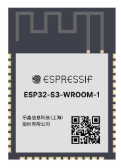
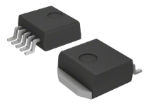
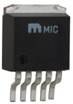
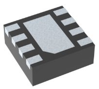
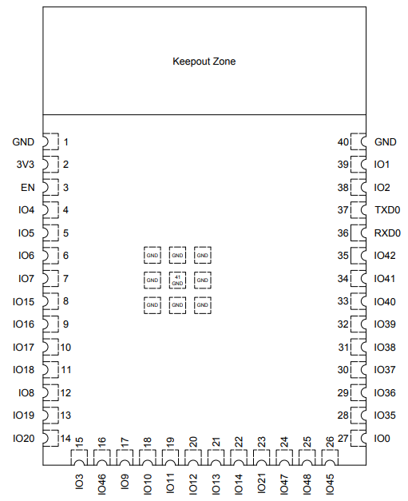

# Component Selection

## Microcontroller Selection

| Solution | Pros | Cons|
|----------|------|-----|
|Option 1  ESP32-S3-WROOM-1-N4 $2.95/Each [RF TX/RX MOD BT WIFI PCB TH SMD](https://www.digikey.com/en/products/detail/espressif-systems/ESP32-S3-WROOM-1-N4/16162639)|<li>We use in class</li><li>Don't have to download new software to program</li>|<li>Many unused pins</li>|

## Switching Voltage Regulator

| Solution | Pros | Cons|
|----------|------|-----|
|Option 1  LM2575D2T-3.3R4G $3.32/Each [IC REG BUCK 3.3V 1A D2PAK-5](https://www.digikey.com/en/products/detail/onsemi/LM2575D2T-3-3R4G/1476688?s=N4IgTCBcDaIDIFkwFYDsyAiYAqBaAzAHT4BKALAOIgC6AvkA)|<li>We used one similar in class</li><li>Easy to solder</li>|<li>Frequency switching is much smaller than option 2</li>|
|Option 2  LM2575-3.3WU-TR $1.75/Each [IC REG BUCK 3.3V 1A TO263-5](https://www.digikey.ch/en/products/detail/microchip-technology/LM2575-3-3WU-TR/1027646)|<li>Easy to solder</li>|<li>Less heat resistant than option 1</li>|
|Option 3  TPS62162DSGR $1.38/Each [IC REG BUCK 3.3V 1A 8WSON](https://www.digikey.ch/en/products/detail/texas-instruments/TPS62162DSGR/2833447)|<li>Small, so saves space on a PCB.</li>|<li>Potentially difficult to solder</li>|

### Rational
My choice for the switching voltage regulator is option 1, LM2575D2T-3.3R4G. This component was chosen due to being familiar with the through hole version. It was also chosen due to the component being potentially the easiest to solder.

# ESP32-S3-WROOM-1-N4 Diagram and Table

| ESP Info                                      | Answer |
| --------------------------------------------- | ------ |
| Model                                         | ESP32-S3-WROOM-1-N4      | 
| Product Page URL                              | [Product page](https://www.espressif.com/en/products/modules) |
| ESP32-S3-WROOM-1-N4 Datasheet URL             | [ESP32-S3-WROOM-1-N4](https://www.espressif.com/sites/default/files/documentation/esp32-s3-wroom-1_wroom-1u_datasheet_en.pdf)      | 
| ESP32 S3 Datasheet URL                        | [ESP32-S3](https://espressif.com/documentation/esp32-s3_datasheet_en.pdf)      | 
| ESP32 S3 Technical Reference Manual URL       | [Technical Manual](https://espressif.com/documentation/esp32-s3_datasheet_en.pdf)      | 
| Vendor link                                   | [Digikey](https://www.digikey.com/en/products/detail/espressif-systems/ESP32-S3-WROOM-1-N4/16162639)      |
| Code Examples                                 | None can be found.      |
| External Resources URL(s)                     | Wifi beginners guide [video](https://www.youtube.com/watch?v=aH3sLEQI4_w)      | 
| Unit cost                                     | $2.95      |             
| Supply Voltage Range                          | 3V / 3.3V / 3.6V      | 
| Absolute Maximum current   (for entire IC) | Not Stated/ MIN current: 500mA     |
| Maximum GPIO current   (per pin)           | 20mA, 1500mA total      | 
| Supports External Interrupts?                 | Yes, only 1.     |
| Required Programming Hardware, Cost, URL      | MPLAB / FREE / [Link to MPLAB](https://www.microchip.com/en-us/tools-resources/develop/mplab-x-ide)      |

| Module         | # Available | Needed | Associated Pins (or * for any) |
| -------------- | ----------- | ------ | ------------------------------ |
| UART           | 2           | 2     | IO17(10), IO18(11)                              |
| external SPI\* | 36           | 0      |                               |
| I2C            | 26          | 0      |                               |
| GPIO           | 36           | 0      |                               |
| ADC            | 20           | 0      |                               |
| LED PWM        | 36           | 1      |   IO46(16)                            |
| Motor PWM      | 36           | 0      |                               |
| USB Programmer | 2           | 2      | IO19(13), IO20(14)                              |

### Role
My role in team 202 is head of the wifi module. My system will connect to wifi, and through an application or web service our user will be able to manipulate our exhibit. My system will communicate to another team member's system and they will communicate to another, resulting in a daisy chain of systems, through this daisy chain process my device will be able to communicate the users responses to other portions of the exhibit and deliver the response the user initiated.
