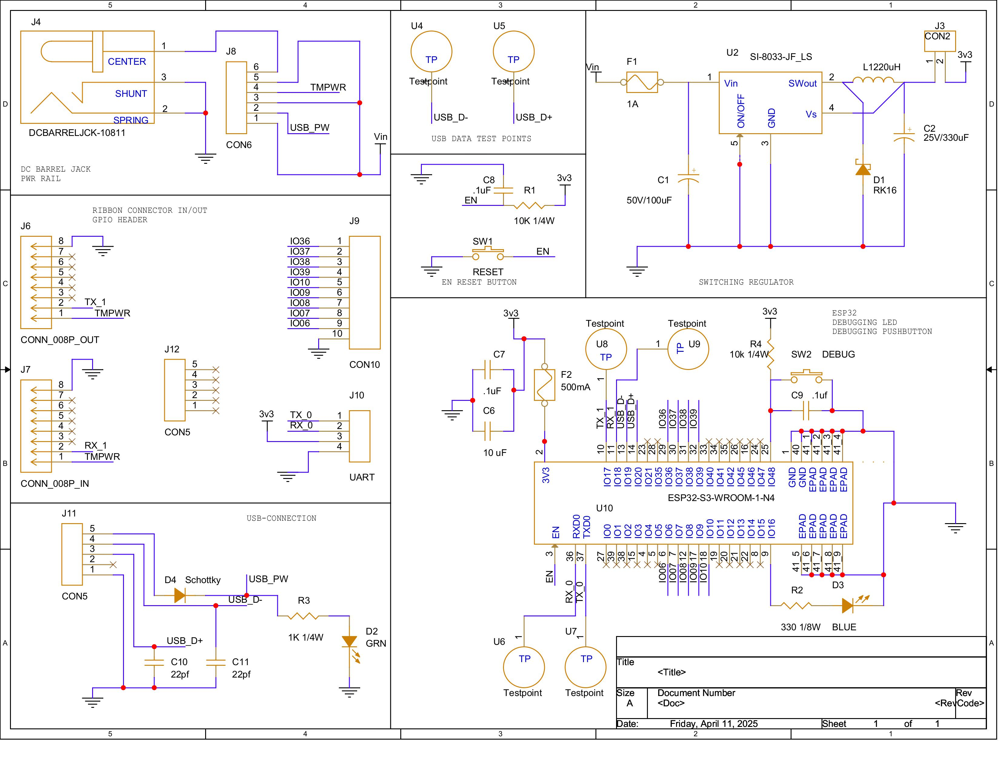

## ESP32 - WIFI SUBSYSTEM

 Below are link for the schematic:
 <li>[PDF](./subfolder/individualSchematic.pdf) of schematic.</li>
 <li>[ZIP file](./subfolder/IndividualSchematic.zip) of project.</li>
 Here is the [code](./subfolder/main.py) to test functionality of system.