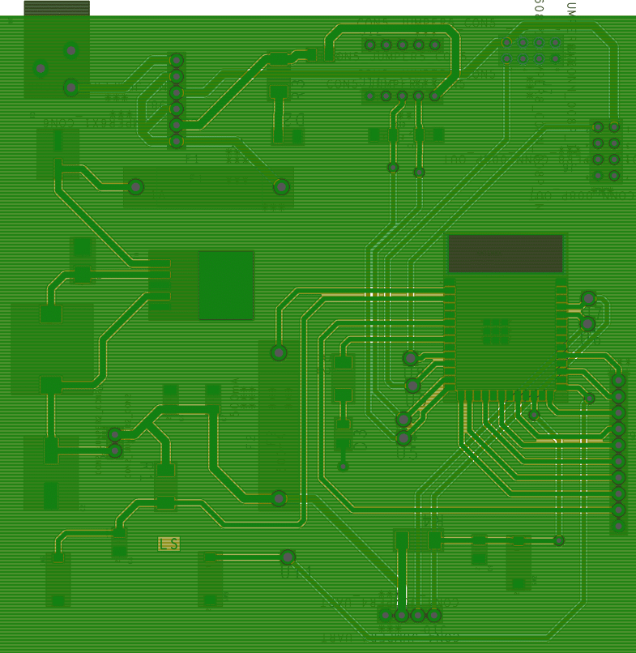

## ESP32 - WIFI SUBSYSTEM

The device's main function is to provide wireless communication, specifically through wifi, to enable external users the ability to operate the exhibit. To provide this feature the ESP32 was chosen, to operate it properly you need to connect decoupling capacitors at each pin that will be receiving power. This allows the device to start up safely. To have a functioning ESP a boot and enable pin needed to be strapped down, preferably to a button. The boot button allows the device to go into bootloader, to be flashed by its user. Each button outside of the bootloader is wired to a pull-up resistor and a capacitor, so that there are no floating values. To program the device, we decided to use its USB feature. By connecting the data pins directly to the data pins of the USB component, we can program the device successfully with a stable voltage. The device that provides the power through USB is protected by a diode, to prevent voltage coming back into it. To protect the ESP and for troubleshooting purposes all pins connected to a power source are connected to jumper, to separate it from receiving power directly.

To provide stable power to the ESP and meet power supply requirements switching buck voltage regulator was chosen. All power goes to a 6-pin jumper, then to the input pin of the LM2575 voltage regulator. The 6-pin jumper has three power sources, team, USB, and barrel jack power. After selecting a power source from the 6-pin jumper it goes through a 1A fuse that provides the voltage regulator circuit protection. The voltage regulators input capacitor prevents large voltage transients and its output capacitor ensures that there is little to no ripple voltage. Connected to the output pin of the voltage regulator is a freewheel diode, this diode connected in parallel with an inductor manages the backwards EMF generated by the inductor when the current is interrupted. When power gets to the inductor it provides a stable voltage and low ripple current for the rest of the device. The output of this portion of the system is connected to the same 2-jumper component that provides power to the ESP.

To complete system and product requirements, unregulated power and ground are connected to two 4x2 headers. One header provides unregulated power to my 6-pin jumper and the other passes it on to the rest of the team. Also connected to this 8-pin header are the TX and RX pins of the ESP, so that the team can communicate to each other via UART. All components combined together, produce an ESP32 capable of wifi communication and team communication.

## Version 2.0

If I were to recreate this board, I would first start by removing any unnecessary components. For example removing the capacitors at the data lines, as they only slow down the data being sent between master and slave device. Although I did not have an issue with RX0 and TX0 I would also remove them and anything associated to those pins from the schematic as they strictly being used for USB communication. I would also orient my ribbon cable headers in the correct position, so that I can operate the device with the team without any additional hardware. Lastly, for the ESP, I would add another GPIO header so that I have a much more capable dev board.

Although I am satisfied with my hardware selection, I would choose a larger USB component. Not only would it be easier to solder than a micro-USB, but also looks neater than a double header supporting a micro-USB dotter board. I would also change my capacitors and inductor at the voltage regulator for a smaller dimension, but same capability component. Or I would change the current footprints in my PCB design to fit the components more appropriately. Fitting the component more accurately to the PCB, results for adequate soldering space as well as reducing the chance in burning the component.

 Below is link for the schematic:
 <li>[PDF](./subfolder/individualSchematic.pdf) of schematic.</li>
 <li>[PDF](./subfolder/TopPCB_Luis.pdf) of PCB.</li>
 <li>[ZIP file](./subfolder/individualSchematic.zip) of project.</li>
